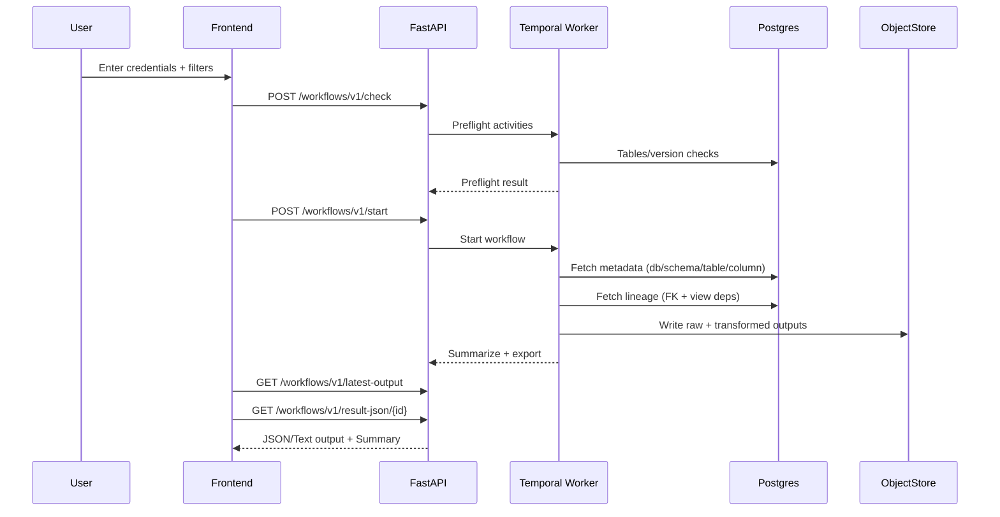

<div align="center">

# SourceSense — Postgres Metadata Extraction (Atlan SDK)

Explore and export Postgres metadata with a clean, reliable developer experience. Built on the Atlan Application SDK (Temporal + Dapr), engineered for clarity and review by Atlan engineers.

</div>

## Why This Repo

This is a focused assignment implementation for a backend engineering role. It showcases:

- A small, robust service that extracts Postgres metadata (db/schema/table/column) and lineage (FK + view dependencies)
- A pragmatic UI for auth, filters, preflight checks, and a Results view with JSON/Text toggle
- Thoughtful reliability hardening (atomic outputs, resilient summary, consistent endpoints)

The goal: be easy to review, easy to run, and easy to reason about.

## At a Glance

- Language/runtime: Python 3.11 (pinned via `.python-version` → 3.11.9)
- Orchestration: Temporal (dev server for local runs)
- Sidecar runtime: Dapr CLI/Runtime 1.13.6
- Frontend: Static HTML/CSS/JS served by FastAPI wrapper in the SDK server
- Outputs: human‑readable text + structured JSON under `output/<workflow_id>/`

## Quick Start (macOS)

1) Copy environment defaults and ensure Python 3.11 is active

```bash
cp .env.example .env
python --version   # should be 3.11.x
```

2) Install/prepare dependencies (optional if you already have them)

```bash
# Dapr 1.13.6
brew uninstall dapr-cli || true
brew install dapr/tap/dapr@1.13
brew link --overwrite dapr@1.13
dapr uninstall --all
dapr init --version 1.13.6

# Temporal dev server
brew install temporal || true
```

3) Start the local sidecars (Dapr + Temporal) in one terminal

```bash
uv run poe download-components    # fetch Dapr component yamls compatible with the SDK
uv run poe start-deps             # starts Dapr + Temporal dev server
```

4) Start the application in another terminal

```bash
uv run main.py
```

Open the UI at: http://localhost:3000/index.html

Endpoints live under: http://localhost:3000/workflows/v1

## Features

- Clean onboarding: connection form, URL parser, password toggle
- Smart filters: include/exclude DB+schemas with cross‑validation
- Preflight checks: database/schema/tables/version
- Extraction: database, schema, table, column
- Lineage: foreign keys + view dependencies
- Outputs: unified text export, JSON export, resilient summary
- Results page: JSON/Text toggle, “latest output” discovery, summary panel

## System Design

```mermaid
flowchart LR
  User[Engineer] --> UI[Frontend (static)]
  UI -->|HTTP| API[FastAPI Server]
  API -->|Start/Signal| Temporal[Temporal Worker]
  Temporal -->|Activities| PG[(Postgres)]
  Temporal -->|ObjectStore| DaprObj[(Dapr Objectstore)]
  Temporal -->|StateStore| DaprState[(Dapr Statestore)]
  API -->|Serve files| Outputs[/output/<workflow_id>/*/]
  UI -->|Poll| API
```

### Workflow Sequence



## How It Works

- `main.py` starts the Temporal worker + SDK server and adds a thin FastAPI layer for results and static `/output` serving
- `app/workflows.py` orchestrates preflight → fetch → transform → summarize → export (text + JSON)
- `app/activities.py` implements Postgres‑specific queries and transformations, writes atomic outputs, and saves a `summary.json`
- SQL lives in `app/sql/` for portability and clarity
- Dapr components in `components/` give a local object store and statestore

## Endpoints

- `POST /workflows/v1/auth` — validate credentials
- `POST /workflows/v1/metadata` — fetch db/schema list (for include/exclude UI)
- `POST /workflows/v1/check` — preflight checks
- `POST /workflows/v1/start` — start a workflow
- `GET /workflows/v1/latest-output` — discover latest workflow id with results
- `GET /workflows/v1/result/{workflow_id}` — text output
- `GET /workflows/v1/result-json/{workflow_id}` — JSON output
- `GET /workflows/v1/summary/{workflow_id}` — summary JSON

## Configuration

Copy defaults and edit as needed:

```bash
cp .env.example .env
```

Include/Exclude filters accept a JSON object of regex patterns per database with regex arrays of schemas, for example:

```json
{
  "^neondb$": ["^public$", "^raw$", "^staging$", "^ref$", "^mart$"]
}
```

The app writes outputs locally under `output/<workflow_id>/`:

- `output.txt` — human‑readable, combined sections for each type
- `summary.json` — counts per type and convenient paths
- `output.json` — consolidated structured data for the UI JSON view

## Development

- Python: 3.11.x only (repo sets `.python-version` to 3.11.9)
- Dapr: 1.13.6 (explicitly linked via Homebrew commands above)
- Temporal: dev server is started by `poe start-deps`
- Task runner: `poethepoet` via `uv run poe ...`

Useful commands:

```bash
uv run poe download-components   # fetch Dapr component yamls
uv run poe start-deps            # start Dapr + Temporal
uv run main.py                   # run the app server
uv run poe stop-deps             # kill common ports if needed
```

## Troubleshooting

- “Results not ready” — wait a few seconds; the Results page polls and tries `/latest-output` and `/result-json/{id}` as fallbacks
- Empty sections — verify include filters match your database/schemas
- Port conflicts — use `uv run poe stop-deps`
- JSON parse errors — the app writes outputs atomically and the result endpoint repairs transient partial reads (should be rare)

## Roadmap (Short)

- Optional: expanded quality metrics roll‑up in summary
- Optional: richer schema stats, sampling, and insights
- Optional: export options (CSV/Excel) revisited later

## License

Apache License 2.0 — see `LICENSE`.
